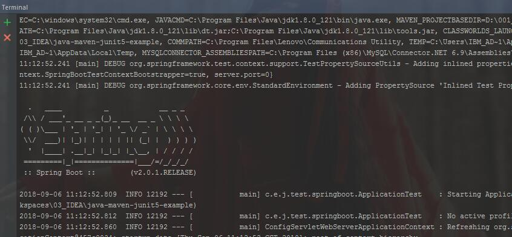
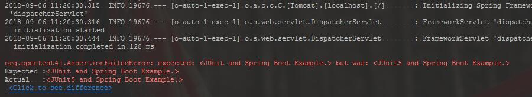
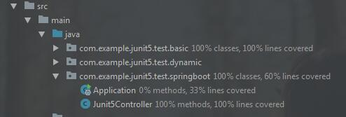
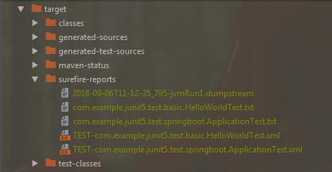

# java-maven-junit5-example

*阅读本文的其他语言版本:[English](README.md).*


## 简介
本repo.主要包括: 使用 JUnit 5 进行单元测试的一些案例

## 示例代码包括

- [X] [Junit 5 基本测试用例](/src/test/java/com/example/junit5/test/basic) (已实现)
- [X] [Junit 5 动态测试](/src/test/java/com/example/junit5/test/dynamic) (已实现)
- [X] [Junit 5 断言测试](/src/test/java/com/example/junit5/test/assertions) (已实现)
- [X] [Junit 5 假定测试](/src/test/java/com/example/junit5/test/assumptions) (已实现)
- [X] [Junit 5 嵌套测试](/src/test/java/com/example/junit5/test/nested) (已实现)
- [X] [Junit 5 忽略/禁用部分测试用例](/src/test/java/com/example/junit5/test/disable) (已实现)
- [ ] [Junit 5 异常控制测试]() (doing...)
- [X] [Junit 5 对Spring Boot项目测试用例](/src/test/java/com/example/junit5/test/springboot) (已实现)
- [ ] [Jenkins + Maven 集成 Junit 5 + TestNG 进行自动化测试]() (做成中...)

## 测试步骤
> NOTE: You can choose *clone* this repo. or *Download Zip* file to local.

1. [克隆仓库](#1-克隆仓库)

   * [导入本地代码(*如果你下载 **Download Zip** 代码到本地*)](#导入本地代码如果你没有利用clone命令进行下载代码的情况)

      * [IntelliJ IDEA](#1-intellij-idea)

      * [Eclipse](#2-eclipse)

2. [运行 Junit 5 进行测试](#2-运行-Junit-5-进行测试)

3. [测试报告](#3-测试报告)

### 1. 克隆仓库

在终端直接运行克隆命令:

```
$ git clone https://github.com/bluetata/java-maven-junit5-example.git
```


#### 导入本地代码(如果你没有利用`clone`命令进行下载代码的情况)

* #### 1. IntelliJ IDEA

菜单栏依次点击: **File –> New –> Project from Exist Sources... –> Existing Maven Projects**

选中本地代码中的 **pom.xml** 文件

依次点击 **Next -> Next -> Next -> Finish** 按钮结束导入操作.

* #### 2. Eclipse

菜单栏依次点击 **File –> Import –> Maven –> Existing Maven Projects**,

选中本地代码,

点击 **Finish** 按钮结束导入操作.

### 2. 运行 Junit 5 进行测试
在终端, 运行:

```
$ mvn test
```

> 如果你使用的是IntelliJ IDEA, 你也可以在测试类中右键点击 : run 'XxxXxxTest' with Coverage 按钮进行运行Junit测试.

### 3. 测试报告

由于使用了 *maven-surefire-report-plugin* 插件, 你可以在该 **scr/target/surefire-reports** 项目路径下找到测试报告.

## 样例输出

> 运行Spring服务



> 测试结果



> 覆盖率



> 测试报告




## 许可协议
[Apache 2.0](LICENSE)


